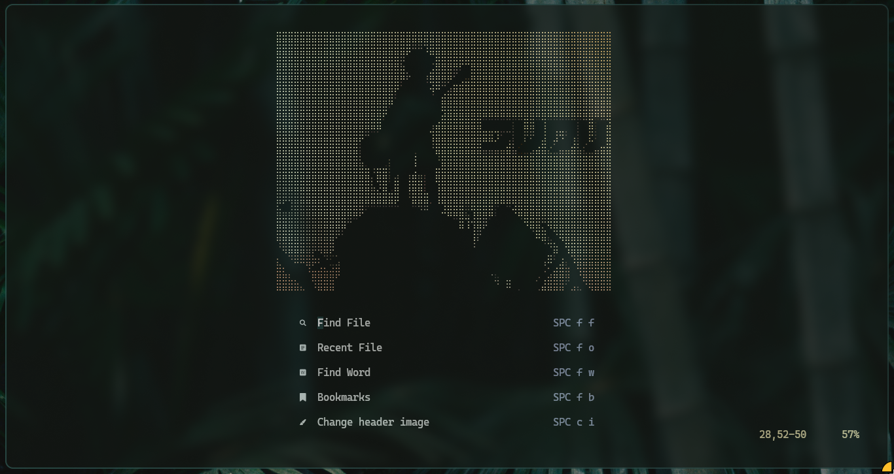
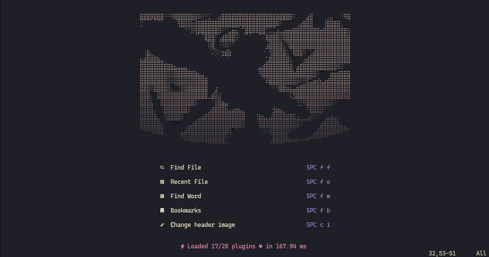
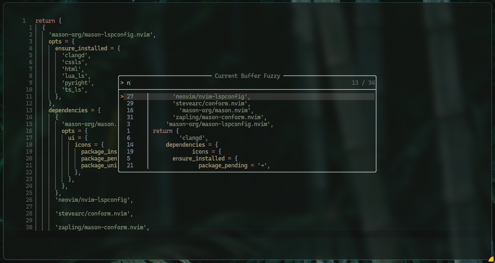
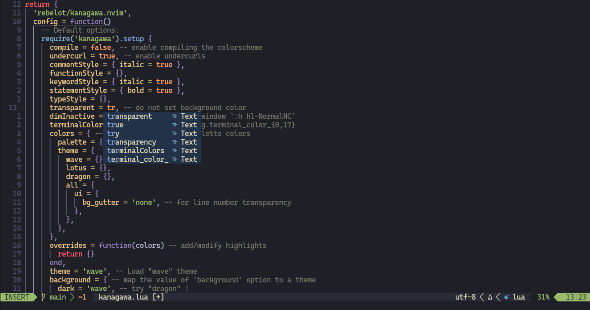

<h1 align="center">
    Noobconfig
</h1>
<h4 align=center>
    This is my personal Neovim setup for productivity!
</h4>

<details><summary> <b>Quick intro</b></summary>

<p align="justify">
Neovim is a terminal text editor focused on extensibility and usability.
It is simple in concept, but extremely powerful and customizable. I've been
using Neovim as my main code editor for almost two years now and never regreted
this decision. If you are coming from a more popular editor (like VSCode, for
example) it might feel a bit confusing and underwhelming at first, but if you
take the time to learn and explore its features and capabilities, you'll certainly
notice how more productive it is to code with it. Of course it's not for
everybody, as different people have different requiremets for an editor (and 
that's ok), but I totally encourage you to give it a chance. You might really 
like it, just as I do!
</p>
    
</details>

---

## SCREENSHOTS






## REQUIREMENTS

- Linux
- Git

## SUPORTED DISTROS

<details><summary><b>Arch Linux</b></summary>
    
#### SETUP
___

```sh
git clone git@github.com:pedrofb7/noobconfig.git
cd noobconfig
./install.sh
./symlink.sh

```

<h5>
Note: The install.sh script only work for Arch and Arch based distros but it 
is possible to dowload the following packages by hand and then run the 
symlink.sh script and it should work just fine:

<p>

Packages:

- nvim
- yazi
- tmux
- gum
</p>

</h5>
</details>

## PLUGINS

- [neovim/nvim-lspconfig](https://github.com/neovim/nvim-lspconfig) - A collection of LSP server configurations for the Nvim LSP client
- [folke/lazy.nvim](https://github.com/folke/lazy.nvim) - The plugin manager used in this setup
- [m4xshen/autoclose.nvim](https://github.com/m4xshen/autoclose.nvim) - To auto pair parenthesis, brackets, etc.
- [stevearc/conform.nvim](https://github.com/stevearc/conform.nvim) - Lightweight yet powerful formatter plugin for Neovim
- [indent-blankline.nvim](https://github.com/lukas-reineke/indent-blankline.nvim) - This plugin adds indentation guides to Neovim
- [hrsh7th/nvim-cmp](https://github.com/hrsh7th/nvim-cmp) - A completion engine plugin for neovim written in Lua
- [nvim-lualine/lualine.nvim](https://github.com/nvim-lualine/lualine.nvim) - A blazing fast and easy to configure Neovim statusline written in Lua
- [goolord/alpha-nvim](https://github.com/goolord/alpha-nvim) - A fast and fully programmable greeter for Neovim
- [nhattVim/alpha-ascii.nvim](https://github.com/nhattVim/alpha-ascii.nvim) - A simple plugin for alpha-nvim that provides custom ASCII headers for the dashboard screen
- [nvim-telescope/telescope.nvim](https://github.com/nvim-telescope/telescope.nvim) - A highly extendable fuzzy finder over lists
- [mbbill/undotree](https://github.com/mbbill/undotree) - To visualize, browse and switch between different undo branches
- [mikavilpas/yazi.nvim](https://github.com/mikavilpas/yazi.nvim) - This plugin allows you to open yazi in a floating window in Neoviom

## Sources

Make sure to check other configs as this is still a pretty simple one. Here are some of
my inspirations:

- Josean-dev = <https://github.com/josean-dev/dev-environment-files/tree/main/.config/nvim>
- ThePrimeagen = <https://github.com/ThePrimeagen/init.lua>
- Harry Dhillon = <https://blog.harryy.dev/posts/make-yazi-change-your-directory/> (I used this article to configure some useful stuff for Yazi,
so definitely check that as well)
